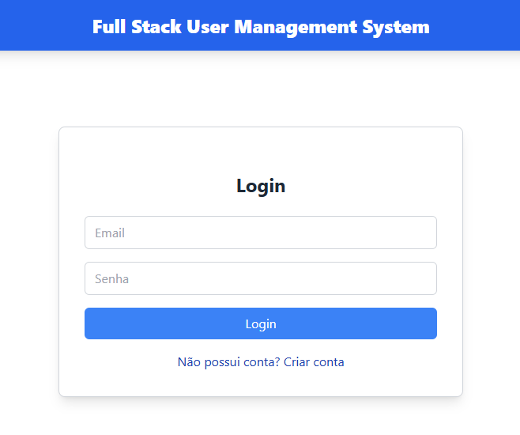
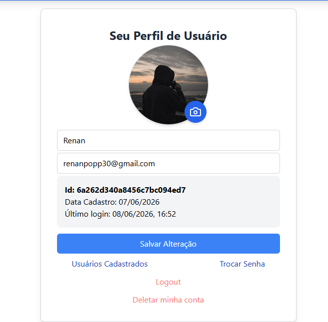
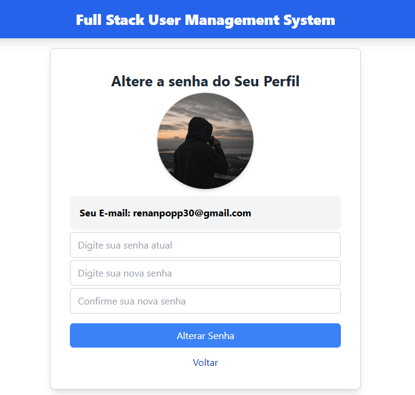

# Full Stack User Management System

Sistema Full Stack de gerenciamento de usuários desenvolvido para aprofundar conhecimentos em React, Node.js, autenticação JWT, banco de dados MongoDB e integração entre Front-end e Back-end.

O projeto permite cadastro, login, autenticação por token, gerenciamento de perfil, upload de foto, alteração de senha, listagem de usuários e exclusão de conta.

## 🔗 Links do Projeto

**Aplicação Online (Frontend)**

https://fullstack-user-management-system-git-main-renanpopp30s-projects.vercel.app/

**Repositório GitHub**

https://github.com/renanpopp30/fullstack-user-management-system

---

# 1. Sobre o Projeto

Este projeto foi desenvolvido com o objetivo principal de aprofundar meus conhecimentos em desenvolvimento Full Stack utilizando React e Node.js.

Durante o desenvolvimento, implementei um sistema completo de autenticação e gerenciamento de usuários, simulando funcionalidades encontradas em aplicações reais.

Além de servir como estudo, este projeto foi estruturado para ser utilizado como base em futuros sistemas, reaproveitando funcionalidades já implementadas como:

* Cadastro de usuários
* Login com autenticação JWT
* Proteção de rotas
* Perfil de usuário
* Upload de imagens
* Alteração de senha
* Gerenciamento de conta

O foco foi entender profundamente a comunicação entre Front-end e Back-end, autenticação baseada em tokens, persistência de dados e integração com serviços externos.

---

# 2. Funcionalidades

## Autenticação

* Cadastro de usuários
* Login com JWT
* Criptografia de senhas utilizando Bcrypt
* Armazenamento seguro do token no Local Storage
* Atualização automática do último login

## Perfil do Usuário

* Visualização dos dados do perfil
* Alteração de nome
* Alteração de e-mail
* Upload de foto de perfil
* Exibição da data de cadastro
* Exibição do último acesso

## Segurança

* Rotas públicas e privadas
* Middleware de autenticação
* Verificação de token JWT
* Proteção de endpoints sensíveis

## Gerenciamento de Conta

* Alteração de senha
* Exclusão de conta
* Logout

## Integrações

* Upload de imagens via Cloudinary
* Envio de e-mail utilizando Resend
* Persistência de dados no MongoDB Atlas

---

# 3. Tecnologias Utilizadas

## Front-end

* React
* React Router DOM
* Axios
* Tailwind CSS
* Vite

## Back-end

* Node.js
* Express
* JWT (JSON Web Token)
* Bcrypt
* Prisma ORM

## Banco de Dados

* MongoDB Atlas

## Serviços Externos

* Cloudinary (armazenamento de imagens)
* Resend (envio de e-mails)

## Deploy

* Vercel (Frontend)
* Railway (Backend)

## Controle de Versão

* Git
* GitHub

---

# 4. Arquitetura

```text
Frontend (React + Vite)
        │
        ▼
Axios HTTP Requests
        │
        ▼
Backend (Node.js + Express)
        │
        ├── JWT Authentication
        ├── Bcrypt Password Hashing
        ├── Prisma ORM
        │
        ▼
MongoDB Atlas

Integrações Externas:
- Cloudinary (Upload de imagens)
- Resend (Notificações por e-mail)
```

## Estrutura do Projeto

```text
fullstack-user-management-system
│
├── backend
│   ├── middlewares
│   ├── prisma
│   ├── routes
│   └── server.js
│
├── frontend
│   ├── src
│   │   ├── pages
│   │   ├── services
│   │   └── App.jsx
│
├── screenshots
│
└── README.md
```

---

# 5. Screenshots

## Tela de Cadastro


## Tela de Login



## Perfil do Usuário



## Lista de Usuários


## Alteração de Senha



## Upload de Foto


---

# 6. Como Rodar Localmente

## Clonar o repositório

```bash
git clone https://github.com/renanpopp30/fullstack-user-management-system.git
```

## Entrar na pasta do projeto

```bash
cd fullstack-user-management-system
```

## Backend

```bash
cd backend

npm install
```

Criar arquivo .env:

```env
DATABASE_URL=
JWT_SECRET=
RESEND_API_KEY=
```

Executar servidor:

```bash
npm run dev
```

---

## Frontend

```bash
cd frontend

npm install

npm run dev
```

Aplicação disponível em:

```text
http://localhost:5173
```

---

# 7. Aprendizados

Este projeto foi um marco importante na minha evolução como desenvolvedor Full Stack.

Durante o desenvolvimento aprofundei conhecimentos em:

* React e criação de interfaces modernas
* React Router e navegação entre páginas
* Hooks como useState, useEffect e useRef
* Comunicação entre Front-end e Back-end
* Criação de APIs REST
* Autenticação utilizando JWT
* Criptografia de senhas com Bcrypt
* Middleware de autenticação
* Integração com MongoDB Atlas
* Utilização do Prisma ORM
* Upload e armazenamento de imagens no Cloudinary
* Envio automático de e-mails utilizando Resend
* Deploy de aplicações utilizando Railway e Vercel
* Organização de projetos Full Stack
* Controle de versão com Git e GitHub

Um dos maiores desafios foi desenvolver a área de perfil do usuário, especialmente as funcionalidades de upload de foto, alteração de dados e troca de senha. Essa parte exigiu bastante raciocínio lógico e entendimento da comunicação entre Front-end, Back-end e banco de dados.

---

# 8. Melhorias Futuras

Algumas melhorias planejadas para próximas versões:

* Validação de formulários mais robusta
* Tratamento avançado de erros
* Recuperação de senha por e-mail
* Refresh Token
* Controle de permissões e níveis de acesso
* Paginação na listagem de usuários
* Dashboard administrativo
* Testes automatizados
* Containerização com Docker
* CI/CD
* Melhor organização utilizando arquitetura MVC completa
* Upload de múltiplas imagens
* Tema Dark Mode

---

# 9. Autor

Renan Popp

Desenvolvedor Full Stack em formação com foco em JavaScript, React, Node.js e desenvolvimento de aplicações web.

GitHub:
https://github.com/renanpopp30

LinkedIn:
(Adicionar perfil)

---

⭐ Se este projeto te ajudou ou serviu como inspiração, considere deixar uma estrela no repositório.